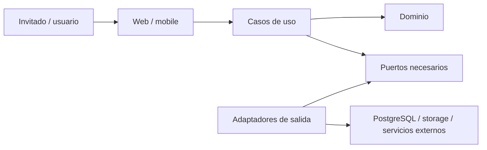

# Arquitectura

> Estado: baseline aceptada; límites del producto en exploración.

## Decisión vigente

Se adopta una Clean Architecture pragmática con principios hexagonales. La regla
central es que la lógica de negocio no depende de frameworks, bases de datos,
transportes ni proveedores cloud. Véase
[ADR-0001](docs/adr/0001-pragmatic-clean-architecture.md).

El backend comenzará como un monolito modular en Go: una unidad desplegable con
límites internos por capacidades que se definirán desde el dominio. Véase
[ADR-0007](docs/adr/0007-use-a-modular-monolith-backend.md).

## Reglas arquitectónicas

1. Las dependencias apuntan hacia el dominio y los casos de uso.
2. Los detalles de infraestructura se conectan en los bordes.
3. Una interfaz existe solo si protege un límite útil, facilita una prueba
   relevante o existen varias implementaciones reales.
4. No se crea una capa, paquete o servicio por simetría.
5. La portabilidad cloud se consigue aislando capacidades del proveedor, no
   construyendo una abstracción universal anticipada.
6. La arquitectura se valida mediante comportamiento y dependencias observables,
   no solo mediante un diagrama.
7. Un nuevo proceso o servicio exige evidencia de necesidad operativa, de
   seguridad, de escala o de autonomía.

## Contexto funcional actual

[PRODUCT.md](PRODUCT.md) define tres perspectivas iniciales: invitado, usuario
autenticado y organizador/participante dentro de un torneo. Existe autorización
para explorar estos límites, pero no para fijar todavía agregados, paquetes,
endpoints ni esquema de datos.

El diagrama muestra la dirección de dependencias, no una estructura obligatoria
de carpetas ni una cantidad de capas.

El contexto completo está en
[docs/diagrams/system-context.md](docs/diagrams/system-context.md).

## Atributos de calidad iniciales

Estos atributos son criterios de evaluación, no objetivos cuantificados todavía:

- mantenibilidad y facilidad de comprensión;
- testabilidad de la lógica de negocio;
- operabilidad y diagnóstico;
- seguridad por diseño;
- portabilidad razonable entre entorno local y cloud;
- coste y complejidad proporcionales al uso.

Los objetivos medibles se decidirán cuando existan requisitos de producto y carga.

## Próximas decisiones

Antes de diseñar el dominio se confirma el
[Technical Baseline](TECHNICAL_BASELINE.md). Después deberán resolverse, en este
orden:

1. formato inicial del torneo y modelo de participante;
2. visibilidad e incorporación;
3. requisitos no funcionales y amenazas;
4. límites del dominio y consistencia;
5. forma de la API;
6. estrategia de persistencia y migraciones;
7. estructura mínima del módulo Go.

Cada punto que alcance el umbral de importancia definido en
[DECISIONS.md](DECISIONS.md) requiere ADR.

## Diagramas

Los diagramas vigentes se indexan en [docs/diagrams](docs/diagrams/README.md). Un
diagrama no sustituye a un ADR ni puede contradecir el texto normativo.
