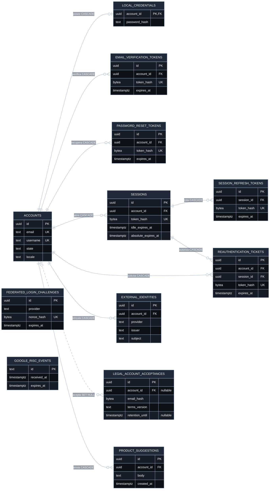
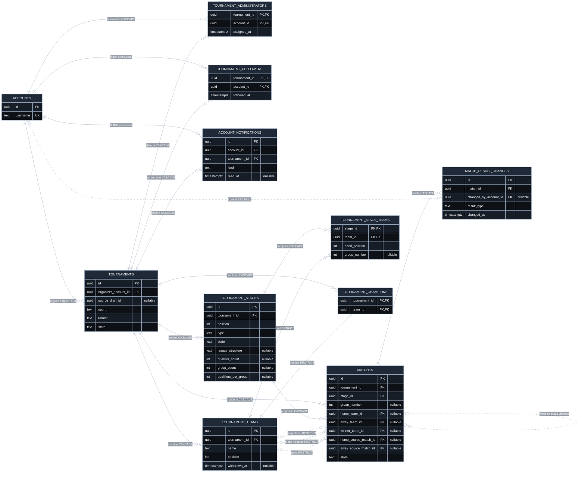

# Mapa entidad-relación de PostgreSQL

> Propósito: mostrar las tablas y relaciones del esquema efectivo.
>
> Alcance: `initial_schema.sql` y migraciones hasta `00011`.
>
> Última revisión: 2026-09-19.

Este mapa es una vista explicativa. La fuente de verdad ejecutable continúa
siendo el [esquema y sus migraciones](../../apps/backend/db/); ante cualquier
divergencia prevalece el SQL aplicado en orden. Se divide en dos vistas porque
un único diagrama con las 21 tablas ocultaría las cardinalidades.

## Identidad y acceso

`federated_login_challenges` y `google_risc_events` no tienen clave foránea: el
primero protege un intento federado previo a conocer la cuenta y el segundo
deduplica eventos RISC por su identificador externo.

## Torneos y competición

Las tres relaciones entre `tournament_teams` y `matches` representan los roles
local, visitante y ganador. Las dos autorrelaciones de `matches` permiten que la
ganadora de un partido alimente la plaza local o visitante de uno posterior.

## Cómo leer el mapa

- `PK`, `FK` y `UK` identifican clave primaria, foránea y única.
- `||` significa exactamente uno; `o|`, cero o uno; `o{`, cero o varios.
- `CASCADE`, `RESTRICT` y `SET NULL` resumen el efecto de borrar la fila padre.
- Las claves únicas compuestas, como `(issuer, subject)` o
  `(organizer_account_id, source_draft_id)`, se explican en el modelo de datos
  pero no se marcan como unicidad individual. Sus restricciones exactas
  permanecen en el SQL.
