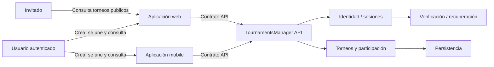

# Contexto inicial del sistema

> Estado: conceptual; no define tecnología ni despliegue.
>
> Fuente funcional: [PRODUCT.md](../../PRODUCT.md)

## Lectura

- Web y mobile son clientes del mismo producto, no fuentes de reglas de negocio.
- El invitado solo necesita la aplicación web para el primer vertical slice; el
  acceso invitado mobile se conserva como capacidad futura.
- Identidad demuestra quién es la persona.
- La API decide qué puede hacer sobre cada torneo.
- Persistencia, email y proveedores son detalles externos.

Los límites exactos se decidirán tras concretar el MVP y la estrategia de
identidad.
