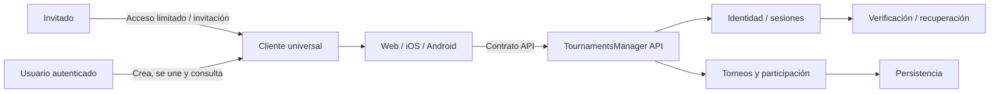

# Contexto del sistema

> Estado: vigente como vista conceptual de producto; el despliegue se documenta
> por separado.
>
> Fuente funcional: [PRODUCT.md](../project/PRODUCT.md)

## Lectura

- Web, iOS y Android son targets de un cliente universal, no fuentes de reglas de
  negocio.
- El comportamiento mantiene paridad funcional y la presentación se adapta a
  móvil, tablet y escritorio.
- El acceso de invitado y las capacidades autenticadas forman parte del mismo
  producto en todos los targets; cada plataforma adapta navegación y pagos sin
  mover reglas de negocio fuera de la API.
- Identidad demuestra quién es la persona.
- La API decide qué puede hacer sobre cada torneo.
- Persistencia, email y proveedores son detalles externos.

Los límites funcionales vigentes están en [PRODUCT.md](../project/PRODUCT.md),
los arquitectónicos en
[ARCHITECTURE.md](../engineering/ARCHITECTURE.md) y los operativos en
[DEPLOYMENT.md](../operations/DEPLOYMENT.md).
