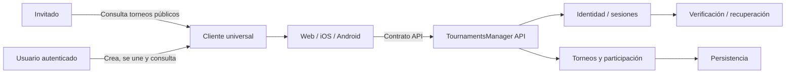

# Contexto inicial del sistema

> Estado: conceptual; refleja la estrategia de cliente de ADR-0008, pero no
> define framework ni despliegue.
>
> Fuente funcional: [PRODUCT.md](../../PRODUCT.md)

## Lectura

- Web, iOS y Android son targets de un cliente universal, no fuentes de reglas de
  negocio.
- El comportamiento mantiene paridad funcional y la presentación se adapta a
  móvil, tablet y escritorio.
- El acceso de invitado forma parte del mismo producto en todos los targets; el
  orden concreto de entrega se decidirá al planificar el vertical slice.
- Identidad demuestra quién es la persona.
- La API decide qué puede hacer sobre cada torneo.
- Persistencia, email y proveedores son detalles externos.

Los límites exactos se decidirán tras concretar el MVP y la estrategia de
identidad.
