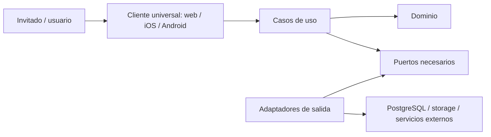

# Arquitectura

> Estado: baseline aceptada; límites del producto en exploración.

## Decisión vigente

Se adopta una Clean Architecture pragmática con principios hexagonales. La regla
central es que la lógica de negocio no depende de frameworks, bases de datos,
transportes ni proveedores cloud. Véase
[ADR-0001](../adr/0001-pragmatic-clean-architecture.md).

El backend comenzará como un monolito modular en Go: una unidad desplegable con
límites internos por capacidades que se definirán desde el dominio. Véase
[ADR-0007](../adr/0007-use-a-modular-monolith-backend.md).

Web, iOS y Android se construirán como un cliente universal con React Native. La
paridad es funcional y semántica; layouts, navegación y adaptadores podrán variar
por plataforma cuando lo exijan el dispositivo, la accesibilidad o la calidad de
la experiencia. Véase
[ADR-0008](../adr/0008-use-a-universal-react-native-client.md).

El cliente usará Expo. Expo Router proveerá rutas universales y CNG generará bajo
demanda los proyectos nativos; `ios/` y `android/` no serán fuente versionada de
verdad. Véase
[ADR-0015](../adr/0015-use-expo-router-and-continuous-native-generation.md).

La web del cliente universal se renderizará inicialmente en el navegador, sin
SSR ni generación estática. La adaptación por plataforma será explícita y
aislada cuando mejore una capacidad concreta. Véase
[ADR-0016](../adr/0016-use-client-side-web-rendering-initially.md).

El cliente se comunicará con el backend Go mediante una API REST descrita
contract-first con OpenAPI. El cliente TypeScript se generará desde ese contrato;
los DTOs y el código generado permanecerán fuera del dominio. Véase
[ADR-0009](../adr/0009-use-rest-and-openapi-contract-first.md).

El backend será autoridad de usuarios, credenciales locales, sesiones y
autorización. Apple y Google serán adaptadores de autenticación federada; sus
identificadores no entrarán en el dominio como identificador de usuario. Véase
[ADR-0010](../adr/0010-own-identity-with-federated-login.md).

PostgreSQL será el sistema de registro principal. El adaptador de persistencia
usará `pgx` nativo y código tipado generado por `sqlc` desde SQL escrito por el
equipo. `goose` gestionará migraciones SQL versionadas fuera del arranque normal
de la API. Ninguna de estas herramientas entra en el dominio. Véase
[ADR-0011](../adr/0011-use-postgresql-pgx-sqlc-and-goose.md).

## Reglas arquitectónicas

1. Las dependencias apuntan hacia el dominio y los casos de uso.
2. Los detalles de infraestructura se conectan en los bordes.
3. Una interfaz existe solo si protege un límite útil, facilita una prueba
   relevante o existen varias implementaciones reales.
4. No se crea una capa, paquete o servicio por simetría.
5. La portabilidad cloud se consigue aislando capacidades del proveedor, no
   construyendo una abstracción universal anticipada.
6. La arquitectura se valida mediante comportamiento y dependencias observables,
   no solo mediante un diagrama.
7. Un nuevo proceso o servicio exige evidencia de necesidad operativa, de
   seguridad, de escala o de autonomía.

## Contexto funcional actual

[PRODUCT.md](../project/PRODUCT.md) define tres perspectivas iniciales: invitado, usuario
autenticado y organizador/participante dentro de un torneo. Existe autorización
para explorar estos límites, pero no para fijar todavía agregados, paquetes,
endpoints ni esquema de datos.



El diagrama muestra la dirección de dependencias, no una estructura obligatoria
de carpetas ni una cantidad de capas.

La implementación actual se recorre con un ejemplo de extremo a extremo en la
[guía del backend](../../apps/backend/README.md). Es una ayuda de navegación y
aprendizaje; las reglas y decisiones normativas de arquitectura siguen estando
en este documento y sus ADR enlazados.

El contexto completo está en
[docs/diagrams/system-context.md](../diagrams/system-context.md).

## Atributos de calidad iniciales

Estos atributos son criterios de evaluación, no objetivos cuantificados todavía:

- mantenibilidad y facilidad de comprensión;
- testabilidad de la lógica de negocio;
- operabilidad y diagnóstico;
- seguridad por diseño;
- portabilidad razonable entre entorno local y cloud;
- coste y complejidad proporcionales al uso.

Los objetivos medibles se decidirán cuando existan requisitos de producto y carga.

## Próximas decisiones

La [Technical Baseline](../governance/TECHNICAL_BASELINE.md) está confirmada.
En el Gate 0B deberán resolverse, en este orden:

1. formato inicial del torneo y modelo de participante;
2. visibilidad e incorporación;
3. requisitos no funcionales y amenazas;
4. límites del dominio y consistencia;
5. forma de la API;
6. estrategia de persistencia y migraciones;
7. estructura mínima del módulo Go.

Cada punto que alcance el umbral de importancia definido en
[DECISIONS.md](../governance/DECISIONS.md) requiere ADR.

## Diagramas

Los diagramas vigentes se indexan en [docs/diagrams](../diagrams/README.md). Un
diagrama no sustituye a un ADR ni puede contradecir el texto normativo.

# Arquitectura

> Cliente universal: arquitectura feature-first y navegación adaptativa aceptadas
> en ADR-0055.

## Cliente universal

El cliente organiza el código por capacidad de producto. Cada feature conserva
pantallas, componentes exclusivos, hooks de coordinación, validación de entrada y
adaptación al cliente OpenAPI. `shared` contiene únicamente UI, feedback y estado
que se haya demostrado común. Las reglas de negocio y autorización residen en el
backend.

```text
apps/client/src/
  app/                  # rutas Expo Router y composición de navegación
  features/<feature>/   # screens, components, hooks, validation y api
  shared/ui/            # primitivas que consumen design-tokens
  shared/feedback/      # banner global cuando se implemente
  shared/session/       # sesión cuando se implemente
  api/generated/        # salida exclusiva de Orval
```

Las rutas profundas tienen URL canónica compartida. Web las presenta directamente;
iOS y Android las presentan como modal. El cierre móvil restaura la vista previa
cuando existe y usa `/` como fallback de inicio en frío; en web siempre navega a
`/`.

La home y la biblioteca de torneos conservan además una adaptación de navegación
acotada: la app mantiene la pila de cada sección mientras permanece activa; la
web usa URLs directas e historial del navegador. Al volver a pulsar la tab web
activa, su URL se reemplaza por la raíz para resolver correctamente una recarga
en una ruta profunda sin pila interna. Las categorías «Administro» y «Sigo» son
proyecciones de relaciones autorizadas por el backend, no estado de permisos en
el cliente. Véase [ADR-0057](../adr/0057-define-contextual-home-and-tournament-library.md).

La implementación inicial usa tres tabs de raíz: Inicio (`/`), Torneos y
Cuenta, en ese orden. Cuenta dispone de un stack propio. En iOS 26 se usa
`NativeTabs` de Expo Router para delegar Liquid Glass al sistema; la barra se
superpone al contenido y cada ruta deja espacio de scroll al final para que la
interacción no quede oculta. La API de Expo está marcada como alpha, por lo que
se revisará en cada actualización de SDK.

El adaptador HTTP centraliza la autenticación de rutas protegidas en middleware:
valida la sesión y deja el ID de cuenta en el contexto de petición. La
autorización sobre una liga continúa en el caso de uso, no en un middleware de
roles. Véase [ADR-0059](../adr/0059-centralize-session-authentication-at-the-http-boundary.md).
